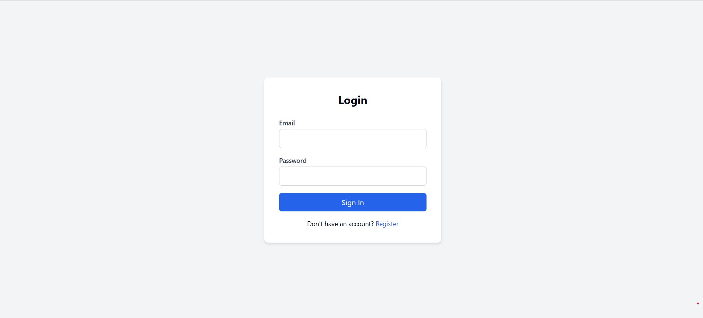
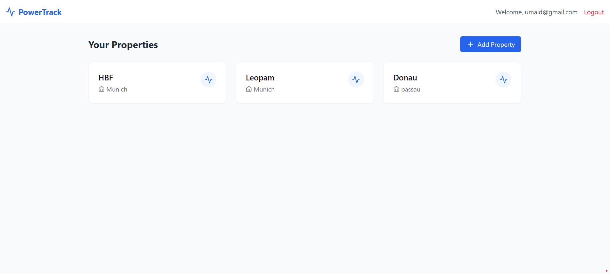
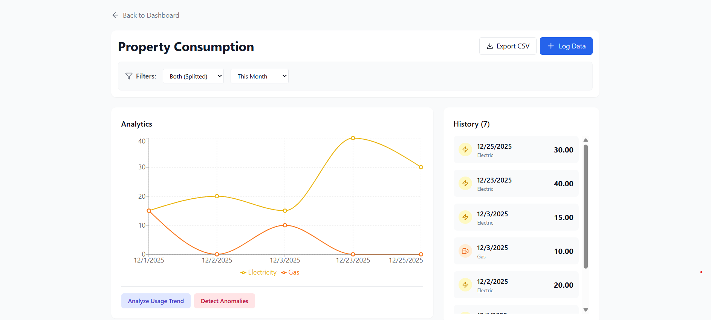
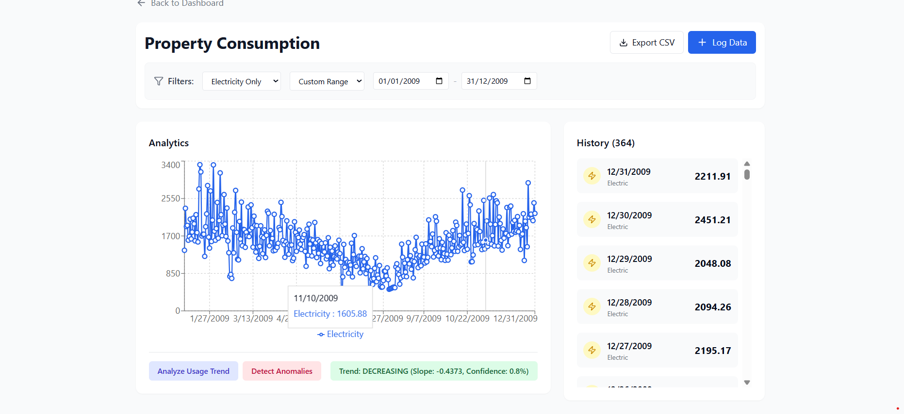
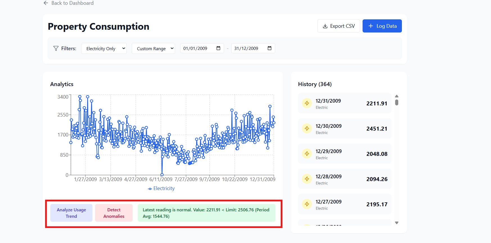
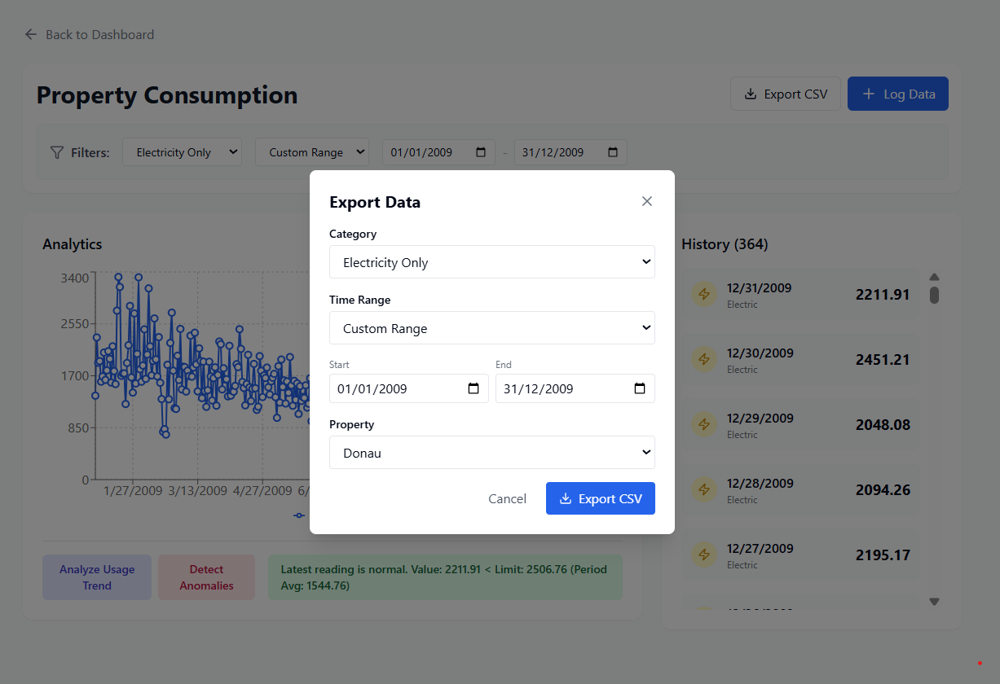
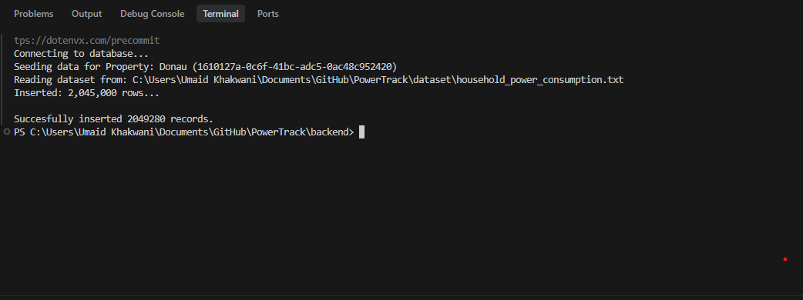
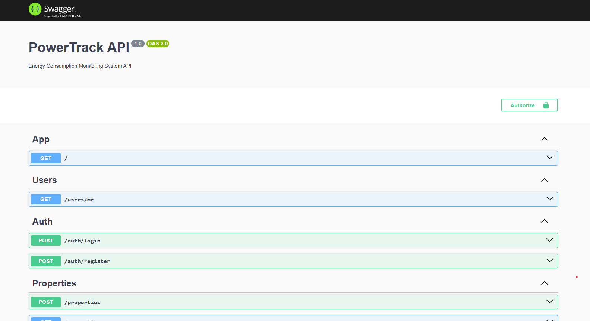
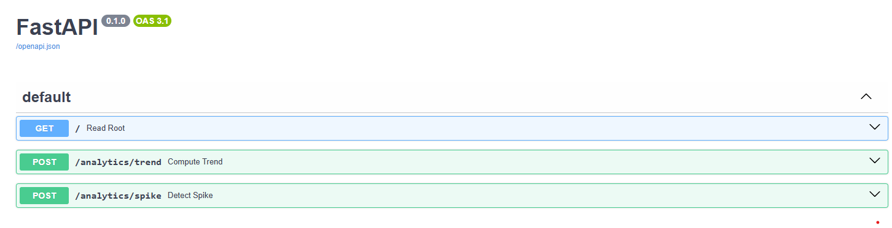

# PowerTrack - Energy Consumption Monitoring System











PowerTrack is a full-stack web application designed to help users track, visualize, and analyze their household energy consumption (Electricity & Gas). It handles large datasets efficiently and provides real-time analytics for trend and anomaly detection.

## 🚀 Features

*   **User Authentication**: Secure Login and Registration (JWT-based).
*   **Property Management**: Manage multiple properties under one account.
*   **Interactive Dashboard**:
    *   Visualize consumption data with dynamic charts (Recharts).
    *   **Smart Resolution**: Automatically switches between Daily, Monthly, and Yearly views based on the selected range.
    *   **Filtering**: Filter by Type (Electric/Gas), Time Range (Day/Month/Year/Custom), and Source.
*   **Advanced Analytics**:
    *   **Trend Analysis**: Detects if usage is increasing, decreasing, or stable using Linear Regression.
    *   **Anomaly Detection**: Identifies usage spikes using Z-Score statistical analysis.
*   **Data Export**: Export data to CSV with granular filters (Category, Time Range, Property).
*   **API Documentation**: Native Swagger/OpenAPI support for both Backend and Analytics Service.
*   **Containerization**: Fully Dockerized for easy deployment.

## 🛠️ Tech Stack

*   **Frontend**: React (Vite), TypeScript, Tailwind CSS, Recharts.
*   **Backend**: NestJS, TypeScript, PostgreSQL (pg), Passport (Auth), Swagger (OpenAPI).
*   **Analytics Service**: Python (FastAPI), Pandas, Statsmodels.
*   **Database**: PostgreSQL.
*   **DevOps**: Docker, Docker Compose.

---

## 📦 Getting Started

### Option A: Run with Docker (Recommended)
You can spin up the entire stack with one command:
```bash
docker-compose up --build
```
This will start:
*   Frontend: `http://localhost:80`
*   Backend: `http://localhost:3000` (API Docs: `/api`)
*   Analytics: `http://localhost:8000` (API Docs: `/docs`)
*   PostgreSQL: `localhost:5432`

### Option B: Manual Setup

### 1. Database Setup
Create a PostgreSQL database named `powertrack`:
```sql
CREATE DATABASE powertrack;
```
*(The backend will automatically create tables on first run)*

### 2. Backend Setup (NestJS)
```bash
cd backend
# Install dependencies
npm install

# Create .env file (if not exists)
# Contents:
# DB_HOST=localhost
# DB_PORT=5432
# DB_USER=postgres
# DB_PASSWORD=postgres
# DB_NAME=powertrack
# JWT_SECRET=supersecretkey
# ANALYTICS_SERVICE_URL=http://localhost:8000

# Start Server
npm run start:dev
```
*Port: 3000*

### 3. Analytics Service Setup (Python)
```bash
cd backend/analytics-service
# Install dependencies
pip install -r requirements.txt

# Start Service
uvicorn main:app --reload --port 8000
```
*Port: 8000*

### 4. Frontend Setup (React)
```bash
cd frontend
# Install dependencies
npm install

# Start Dev Server
npm run dev
```
*Port: 5173*

### 5. Data Seeding (Optional - Large Dataset)
To import the `household_power_consumption.txt` dataset:
```bash
cd backend
npm run seed
```

---

## 🧪 Manual Testing Guide

### 1. Authentication
*   Go to `http://localhost:5173/register` and create an account.
*   Login with your credentials.

### 2. General Usage
*   **Add Property**: Click "Add Property", enter a name and address.
*   **Log Data**: Go to Property Details -> "Log Data" -> Add a manual entry.
*   **View Graph**: Select "This Month" or "This Year" to see the graph update. Ensure "Both" displays two lines (Electricity & Gas).

### 3. Analytics Features
*   Select a Time Range (e.g., "This Year").
*   Click **"Analyze Usage Trend"**:
    *   *Expectation*: Result shows "Increasing", "Decreasing", or "Stable" with a confidence score.
*   Click **"Detect Anomalies"**:
    *   *Expectation*: Result shows either "Latest reading is normal" or "ANOMALY DETECTED" with the calculated Limit and Period Average.

### 4. Export
*   Click **"Export CSV"**.
*   Select "Electricity Only" and "This Month".
*   Open the downloaded CSV and verify it only contains electricity data for the current month.
